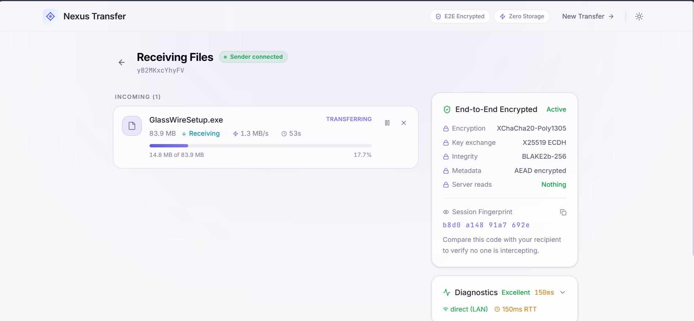
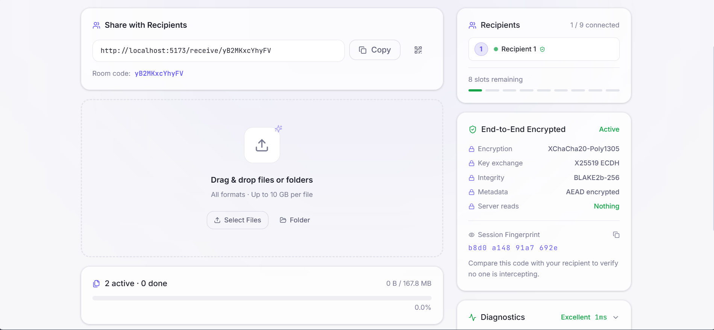
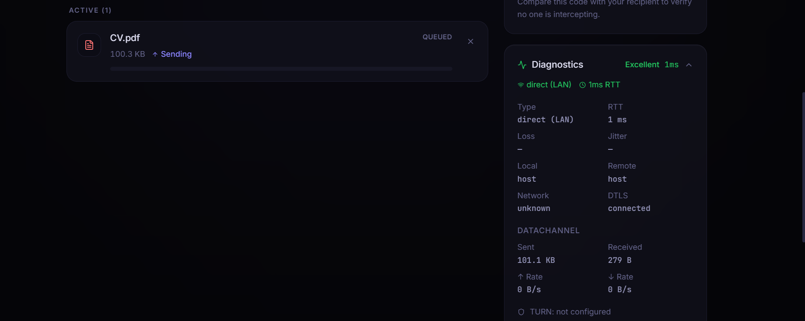
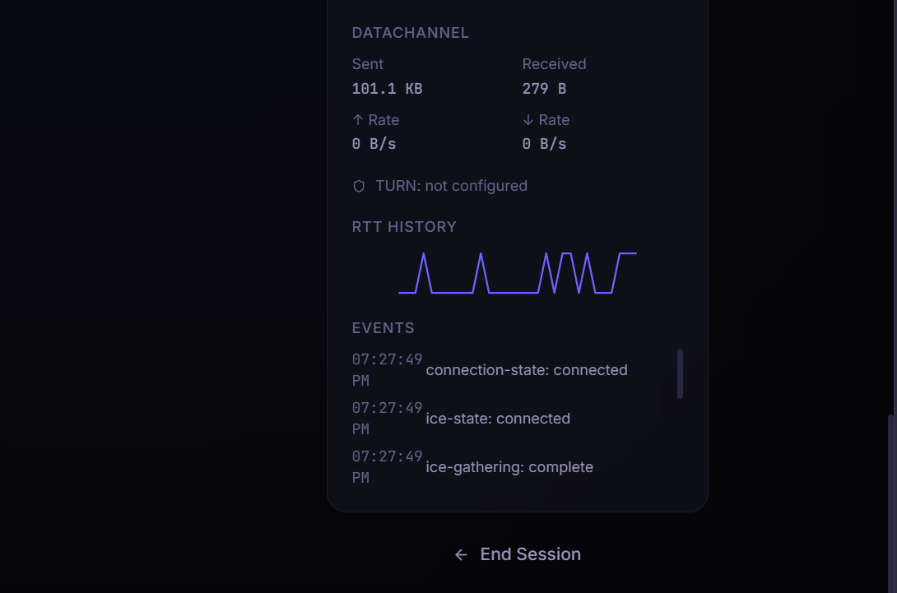

#Nexus Transfer

<p align="center">
  
</p>

<p align="center">


</p>

A production-grade peer-to-peer encrypted file transfer application built with React, WebRTC, Node.js, and libsodium.

Transfer files directly between browsers with end-to-end encryption. No cloud storage, no intermediary file uploads, and no accounts required.


<p align="center"> <i>Files never pass through the server.</i><br/> <i>Your browser encrypts the data, establishes a direct WebRTC connection, and transfers it securely to the recipient.</i> </p>

## Why Nexus Transfer?

Traditional file-sharing services upload your files to centralized servers before the recipient can download them. While convenient, this introduces additional storage, infrastructure costs, and privacy concerns.

**Nexus Transfer** takes a different approach.

Files are encrypted on the sender's device and transferred directly between browsers over a secure WebRTC DataChannel. The backend acts only as a signaling service to establish the peer-to-peer connection. It never stores uploaded files, never has access to encryption keys, and cannot decrypt transferred data.

This project was built to explore modern real-time web technologies, including peer-to-peer networking, application-layer encryption, resilient file streaming, and production-oriented software architecture, while demonstrating how secure browser-to-browser communication can be achieved without relying on cloud file storage.

---

## Table of contents

- [Features](#features)
- [Architecture](#architecture)
- [Security model](#security-model)
- [Tech stack](#tech-stack)
- [Project structure](#project-structure)
- [Getting started](#getting-started)
- [Configuration](#configuration)
- [Scripts](#scripts)
- [API reference](#api-reference)
- [Deployment](#deployment)
- [Browser support](#browser-support)
- [Known limitations](#known-limitations)
- [Contributing](#contributing)
- [License](#license)

---

## Features

### 🔐 Secure by Design

* End-to-end encryption using **libsodium**
* X25519 key exchange with ephemeral session keys
* XChaCha20-Poly1305 authenticated encryption
* BLAKE2b integrity verification
* Session fingerprint verification for MITM detection
* Zero server-side file storage

### ⚡ High-Performance Transfers

* Direct browser-to-browser transfers over WebRTC DataChannels
* Chunked streaming with adaptive chunk sizing
* Sliding-window acknowledgements and automatic retransmission
* Pause, resume, and cancel transfers
* Large-file optimization with direct-to-disk streaming
* Live transfer speed and ETA

### 🌐 Reliable Connectivity

* STUN/TURN support for NAT traversal
* Automatic ICE recovery and reconnection
* Multi-recipient transfers (up to 9 peers)
* QR code pairing for quick device connections
* Self-destructing transfer rooms
* Real-time connection diagnostics

### 🎨 Modern User Experience

* Drag-and-drop support for files and folders
* Multi-file transfer queue
* Transfer history
* Browser notifications and toast feedback
* Responsive layout
* Dark and light themes
* Keyboard navigation and accessibility support


## Demo

Explore Nexus Transfer in action.

 🌐 Live Demo     | https://p2p-encrypted-file-transfer-fronten.vercel.app

## Screenshots

| Home | Transfer |
|------|----------|
| <a href="./docs/images/home.png"></a> | <a href="./docs/images/hero.png"></a> |

| QR Pairing | Diagnostics |
|------------|-------------|
| <a href="./docs/images/qr-pairing.png"></a> | <a href="./docs/images/diagnostics.png"></a> |


> **Note:** Browser-to-browser transfers require two peers. For the best experience, open the application on two different browsers or devices connected to the internet.


## Architecture

Nexus Transfer is organized into three independent layers. Each layer has a single responsibility, making the system modular, easier to maintain, and easier to reason about.

### 1. Signaling Layer

**Location:** `backend/`

**Responsibilities**

* Create and manage transfer rooms
* Discover peers
* Relay SDP offers and answers
* Relay ICE candidates
* Serve STUN/TURN configuration
* Coordinate peer lifecycle

> **Important:** The signaling server never stores files, never receives encrypted payloads, and never has access to encryption keys.

---

### 2. WebRTC Transport Layer

**Location:** `frontend/src/lib/peerConnection.js`

**Responsibilities**

* Establish direct peer-to-peer connections
* Create reliable WebRTC DataChannels
* Perform Perfect Negotiation
* Handle ICE restarts
* Escalate to TURN when necessary
* Monitor connection quality

---

### 3. Secure Transfer Layer

**Location:** `frontend/src/lib/`

**Responsibilities**

* Perform key exchange
* Encrypt file metadata
* Encrypt file chunks
* Stream data efficiently
* Handle acknowledgements
* Verify integrity
* Reconstruct transferred files

---

### Internal Library Structure

```text
frontend/src/lib/
├── crypto.js
├── signalingClient.js
├── peerConnection.js
├── fileChunker.js
├── transferEngine.js
└── browserCompat.js
```

The architecture intentionally separates signaling, networking, and cryptography into independent layers so that each concern can evolve without tightly coupling the rest of the system.

---

## Security model

Security is a core design principle of Nexus Transfer, not an additional feature layered onto the application.

The system follows a **defense-in-depth** approach by combining WebRTC's built-in transport encryption with modern application-layer cryptography. Even if the signaling server were fully compromised, it would still be unable to decrypt transferred files because encryption keys never leave the participating browsers.

The table below summarizes the primary security mechanisms used throughout the application.

| Concern | Implementation |
|---|---|
| Key exchange | X25519 (Curve25519) via `crypto_kx`, ephemeral per session |
| Chunk encryption | XChaCha20-Poly1305 via `crypto_secretstream` — built-in sequence numbers, replay protection, and a `TAG_FINAL` sentinel on the last chunk |
| Per-file keys | Derived from the session key via `crypto_kdf` — no key reuse across files within one session |
| Metadata encryption | XChaCha20-Poly1305-IETF AEAD, with the transfer ID as additional authenticated data (binds ciphertext to one specific transfer, preventing replay across transfers) |
| Integrity | Streaming BLAKE2b-256 over the plaintext, computed during encryption (sender) and decryption (receiver), compared after the final chunk |
| MITM detection | Session fingerprint = BLAKE2b-256 of both public keys (stable ordering), shown to both parties for manual verification |
| Server visibility | Room ID, peer count, and opaque SDP/ICE blobs only — the signaling server cannot read SDP content meaningfully (it's not file data) and never sees encryption keys, file names, or file contents |
| Key hygiene | Session and per-file keys are zeroed (`zeroKey()`) immediately after use and on connection teardown |
| Transport | DTLS-SRTP via WebRTC's mandatory encryption, on top of the application-layer encryption above (defense in depth) |

---

### Threat Model

Nexus Transfer is designed to minimize trust in the backend infrastructure.

The signaling server facilitates peer discovery and WebRTC negotiation but is intentionally excluded from the encrypted data path.

As a result:

* File contents are never uploaded to the server.
* Encryption keys never leave the client.
* Metadata required for decryption is encrypted before transmission.
* Every transferred file is authenticated and verified before reconstruction.
* Session fingerprints allow participants to verify they are communicating with the intended peer.

---

### Server Visibility

| The server **can** see | The server **cannot** see |
|-------------------------|---------------------------|
| Room IDs | File contents |
| Peer connection timing | File names |
| Peer IP addresses | Encryption keys |
| SDP / ICE messages | Session keys |
| Room membership | Session fingerprints |
| Connection metadata | Plaintext metadata |

> **Privacy by Design:** The application is intentionally architected so that compromising the signaling server alone is insufficient to expose transferred files. Trust is placed only in the communicating peers, not in the intermediary infrastructure.

---

## Tech Stack

| Category                    | Technologies                                   |
| --------------------------- | ---------------------------------------------- |
| **Frontend**                | React 19, Vite, React Router, Tailwind CSS     |
| **Backend**                 | Node.js, Express, WebSocket (`ws`)             |
| **Real-Time Communication** | WebRTC DataChannels, STUN, TURN                |
| **Cryptography**            | libsodium, X25519, XChaCha20-Poly1305, BLAKE2b |
| **State Management**        | React Context + Reducer                        |
| **Build Tools**             | npm Workspaces, ESLint, Prettier               |
| **Utilities**               | QRCode, NanoID, Helmet, Express Rate Limit     |
| **Deployment**              | Vercel (Frontend), Node.js Server (Backend)    |

## Engineering Concepts Demonstrated

This project explores several advanced software engineering concepts, including:

* Peer-to-peer networking with WebRTC
* End-to-end encryption and authenticated cryptography
* Real-time communication over WebSockets
* Chunked binary streaming and flow control
* Adaptive networking and NAT traversal
* Client-side file processing
* Secure key exchange
* Modular application architecture
* Responsive and accessible user interface design
* Production-oriented deployment and configuration

---

### Project structure

The repository is organized as a lightweight monorepo with clearly separated frontend, backend, and shared modules. Each directory has a focused responsibility, making the application easier to extend and maintain.

| Directory   | Purpose                                                                                              |
| ----------- | ---------------------------------------------------------------------------------------------------- |
| `frontend/` | React application, UI components, state management, and WebRTC client                                |
| `backend/`  | Express server responsible for signaling, room management, and TURN configuration                    |
| `shared/`   | Constants, event names, protocol definitions, and shared utilities used by both frontend and backend |

```text
p2p-transfer/
├── frontend/
│   ├── src/
│   │   ├── components/
│   │   │   ├── layout/       AppShell, header, footer
│   │   │   ├── transfer/     DropZone, TransferItem, diagnostics, security panel
│   │   │   ├── qr/           QR code display + pairing modal
│   │   │   └── ui/           Button, Badge, Toast, Skeleton, EmptyState, ThemeToggle…
│   │   ├── hooks/            useRoom, useDropZone, useTheme, useNotifications…
│   │   ├── lib/               crypto, peerConnection, transferEngine, fileChunker…
│   │   ├── pages/             HomePage, TransferPage, ReceivePage, NotFoundPage
│   │   ├── store/             appStore.jsx — reducer + selectors
│   │   └── styles/            globals.css — theme tokens, glassmorphism, animations
│   ├── vite.config.js
│   └── tailwind.config.js
├── backend/
│   ├── src/
│   │   ├── signaling/         RoomManager, signalingServer (WS handler)
│   │   ├── middleware/        CORS, helmet, rate limiting
│   │   ├── utils/             logger
│   │   ├── routes.js          REST API (rooms, ICE config, health)
│   │   └── index.js           Entry point
│   └── config/                Environment config loader
└── shared/
    └── constants.js           Event names, chunk sizes, timeouts — imported by both sides

```
---

### Design Principles

The project follows a modular architecture where each layer has a single responsibility.

* **Frontend** focuses on presentation, user interaction, and client-side networking.
* **Backend** is intentionally lightweight and acts only as a signaling service.
* **Shared modules** ensure both applications use the same protocol definitions and event contracts.
* **Networking, cryptography, and UI** remain loosely coupled to simplify testing and future maintenance.

This separation reduces complexity, improves maintainability, and makes individual components easier to evolve independently.

---

## Getting started

> **Quick Start**
>
> Clone the repository, install dependencies, configure the environment files, and start both the frontend and backend with a single command.
>
> Typical setup takes less than **5 minutes**.

---

### Prerequisites

### 1. Clone the repository

```bash
git clone https://github.com/shehzadres/p2p-encrypted-file-transfer.git

cd p2p-encrypted-file-transfer

- Node.js 18 or later
- npm 9 or later
- Two browser windows/devices for testing (sender + receiver)

### Install

```bash
npm install
```

This installs dependencies for the root, `frontend/`, and `backend/` workspaces in one pass.

### Configure environment

```bash
cp backend/.env.example backend/.env
cp frontend/.env.example frontend/.env
```

The defaults work out of the box for local development. See [Configuration](#configuration) for production values, especially TURN credentials.

### Start the development environment

```bash
npm run dev
```

This starts both servers concurrently:
- Frontend: **http://localhost:5173**
- Backend: **http://localhost:3001**

Open the frontend URL in two browser windows (or one normal + one incognito) to test a transfer between two "peers" on the same machine.

### Development Workflow

1. Start the development servers.
2. Open the application in two browser windows or on two different devices.
3. Create a transfer room.
4. Join the room from the second peer.
5. Transfer one or more files.
6. Verify the transfer completes successfully.

### Build for production

```bash
npm run build      # builds the frontend into frontend/dist
npm start           # starts the backend (serves the API + WebSocket only)
```

The backend does **not** serve the frontend's static files — see [Deployment](#deployment) for how to host them.

### Verify the Installation

Once both services are running, you should be able to:

* Create a new transfer room.
* Join from another browser or device.
* Establish a peer-to-peer connection.
* Transfer files successfully.
* Observe live transfer progress and connection diagnostics.

If all of the above work, the project has been configured correctly.

## Configuration

### Backend (`backend/.env`)

| Variable | Default | Description |
|---|---|---|
| `PORT` | `3001` | HTTP/WebSocket port |
| `NODE_ENV` | `development` | `development` or `production` |
| `CORS_ORIGIN` | `http://localhost:5173` | Allowed frontend origin |
| `ROOM_CLEANUP_INTERVAL_MS` | `60000` | How often expired rooms are pruned |
| `LOG_LEVEL` | `info` | `error` \| `warn` \| `info` \| `debug` |
| `TURN_URL` | _(empty)_ | e.g. `turn:turn.example.com:3478` — leave empty to run STUN-only |
| `TURN_USERNAME` / `TURN_CREDENTIAL` | _(empty)_ | Static TURN credentials (use **either** this pair **or** `TURN_SECRET`) |
| `TURN_SECRET` | _(empty)_ | Shared secret for HMAC time-limited TURN credentials (coturn-compatible, RFC 5766) — preferred over static credentials |
| `TURN_TTL_SECONDS` | `86400` | How long HMAC TURN credentials remain valid |

### Frontend (`frontend/.env`)

| Variable | Default | Description |
|---|---|---|
| `VITE_WS_URL` | `ws://localhost:3001/ws` | Signaling WebSocket endpoint |
| `VITE_API_URL` | `http://localhost:3001/api` | Signaling REST endpoint |
| `VITE_APP_NAME` | `Nexus Transfer` | Display name |

In production, point both at your deployed backend's public URL (`wss://` and `https://` respectively).

### TURN servers

STUN alone is sufficient for most networks, but symmetric NATs and some corporate firewalls require a TURN relay. Without TURN configured, transfers between peers on such networks will fail to connect. You can use any RFC 5766-compatible TURN server (coturn is a common self-hosted option, or a managed service). Configure either static or HMAC credentials — HMAC is recommended since credentials rotate automatically and are never stored long-term.

## Scripts

Run from the repo root:

| Command | Effect |
|---|---|
| `npm run dev` | Start both frontend and backend in watch mode |
| `npm run build` | Production build of the frontend |
| `npm start` | Start the backend in production mode |
| `npm run lint` | Lint both workspaces |
| `npm run format` | Format all files with Prettier |


## API reference

All endpoints are under `${VITE_API_URL}` (default `http://localhost:3001/api`).

| Method | Path | Description |
|---|---|---|
| `GET` | `/health` | Server status, room/peer counts, TURN availability |
| `GET` | `/ice-config` | RTCConfiguration `iceServers` array (STUN + TURN if configured) |
| `POST` | `/rooms` | Create a room. Body: `{ selfDestruct?, expiryTier?, maxPeers? }` |
| `GET` | `/rooms/:roomId` | Room metadata (peer count, expiry, self-destruct status) |
| `POST` | `/rooms/:roomId/done` | Mark a self-destruct room's transfer complete |

WebSocket signaling (`${VITE_WS_URL}`) uses a JSON envelope `{ event, data }` — see `shared/constants.js` for the full event list and `backend/src/signaling/signalingServer.js` for the handler implementation.

## Deployment

See **[DEPLOYMENT.md](./DEPLOYMENT.md)** for platform-specific guides (Docker, a VPS with systemd, Vercel + Railway, and a managed TURN setup).

## Browser support

Requires WebRTC DataChannels, WebAssembly (for libsodium), Web Crypto, and `Blob`/`URL.createObjectURL`. Verified on:

- Chrome / Edge 80+
- Firefox 75+
- Safari 15+

The app runs a capability check (`frontend/src/lib/browserCompat.js`) on startup and shows a clear error screen listing exactly which API is missing if the browser doesn't qualify, rather than failing silently or partially.

Large-file disk streaming (files >500 MB) additionally uses the File System Access API (`showSaveFilePicker`), currently Chromium-only; other browsers automatically fall back to in-memory assembly for those files.

## Roadmap

While Nexus Transfer is fully functional, several enhancements are planned for future iterations.

### Planned Features

* [ ] Resumable transfers across browser restarts
* [ ] Optional password-protected transfer rooms
* [ ] Drag-and-drop directory synchronization
* [ ] Progressive Web App (PWA) support
* [ ] Native desktop application (Electron or Tauri)
* [ ] Transfer compression for compressible file types
* [ ] Transfer analytics dashboard
* [ ] Internationalization (i18n)

### Performance & Networking

* [ ] WebTransport evaluation when browser support matures
* [ ] Smarter congestion control
* [ ] Improved adaptive chunk sizing
* [ ] Better bandwidth estimation
* [ ] Enhanced multi-peer scheduling

### Developer Experience

* [ ] Automated end-to-end testing
* [ ] Docker development environment
* [ ] GitHub Actions CI/CD pipeline
* [ ] Performance benchmarking suite
* [ ] API documentation improvements


## Known limitations

- **No resumable transfers across page reloads.** Pause/resume works within a session, but closing the tab loses transfer state — there's no persisted chunk log to resume from on reload.
- **Multi-recipient mode sends sequentially per peer, not as a true broadcast.** Each connected peer gets an independent encrypted stream; bandwidth scales linearly with recipient count rather than using a multicast tree.
- **Self-destruct rooms are time-windowed (1 hour) in addition to single-use.** If the recipient never joins, the room still expires on the timer even though no transfer occurred.
- **No persistent server-side audit log.** This is intentional (privacy-by-design — the server is meant to know as little as possible) but means there's no way to investigate abuse after a room has expired.

## Contributing

See [CONTRIBUTING.md](./CONTRIBUTING.md) for setup instructions, testing expectations, and where things live in the codebase.

## License

MIT
